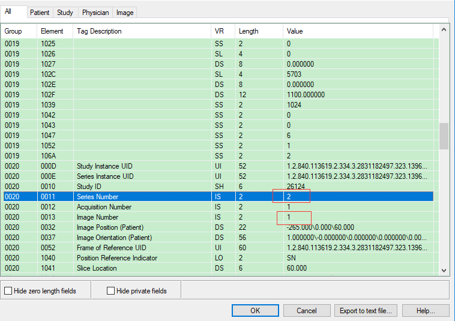
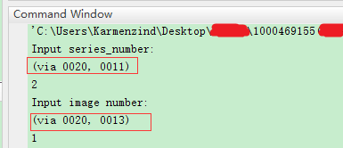
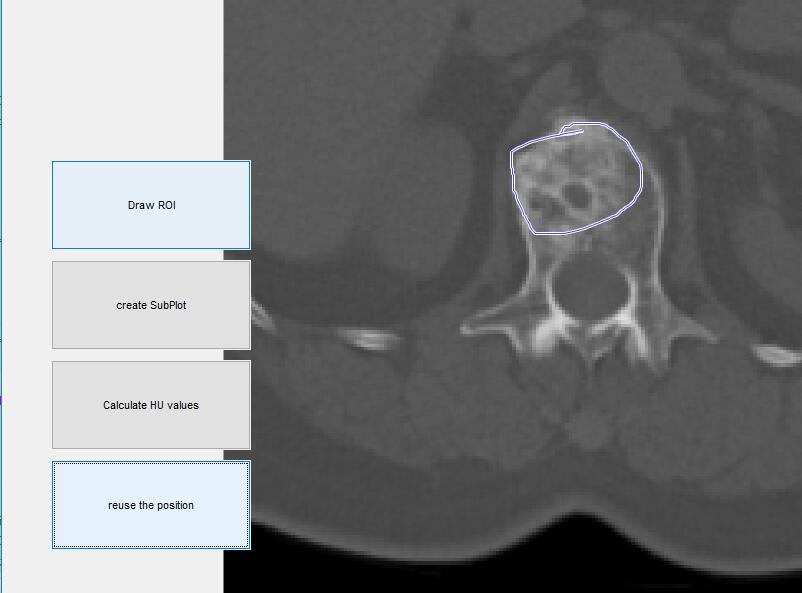

## this is a CT value caculator for DICOM file

implemented in MATLAB 2016b

1. Locate DICOM file via series information. Set up window level parameters.
2. Draw a free draggable ROI.
3. Caculate the area of ROI, as well as CT values(in Hounsfield Units, including average, median, maximum and minimum).
4. Reuse the ROI on the other DICOM file and caculate new values if needed.

*****

##### Work like this:

firstly, find the related infomation of the picture via a regular DICOM viewer program

run main.m and input the numbers, window level, etc

then get a gui

